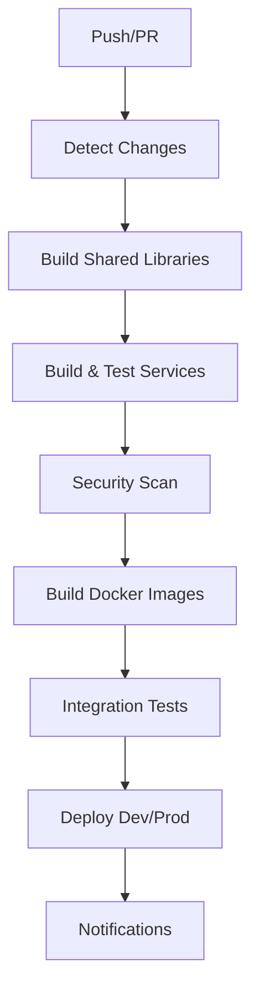

# 🚀 Financer CI/CD Pipeline Documentation

Este documento descreve o sistema completo de CI/CD implementado para o projeto Financer, incluindo todos os workflows, configurações e práticas recomendadas.

## 📋 Índice

1. [Visão Geral](#visão-geral)
2. [Arquitetura dos Pipelines](#arquitetura-dos-pipelines)
3. [Workflows Implementados](#workflows-implementados)
4. [Configurações](#configurações)
5. [Práticas de Desenvolvimento](#práticas-de-desenvolvimento)
6. [Monitoramento e Alertas](#monitoramento-e-alertas)
7. [Troubleshooting](#troubleshooting)

## 🎯 Visão Geral

O sistema CI/CD do Financer foi projetado para:

- ✅ **Automação Completa**: Build, test, security scan e deploy automatizados
- 🔍 **Detecção Inteligente**: Identifica mudanças e constrói apenas o necessário
- 🛡️ **Segurança Integrada**: Scans de segurança e dependências em cada build
- 📊 **Monitoramento Contínuo**: Health checks e relatórios automatizados
- 🔄 **Dependências Atualizadas**: Dependabot para manter dependências atuais

## 🏗️ Arquitetura dos Pipelines

### Pipeline Principal (`ci-cd-main.yml`)



### Estratégia de Branches

- **`master/main`**: Production deployments
- **`develop`**: Development deployments  
- **`feature/*`**: Feature development (no deploy)
- **Tags `v*`**: Release deployments

## 🔧 Workflows Implementados

### 1. Pipeline Principal (`ci-cd-main.yml`)

**Trigger**: Push para `main/master/develop` ou Pull Request

**Jobs**:
- 🔍 **detect-changes**: Identifica serviços modificados
- 📦 **build-shared**: Constrói bibliotecas compartilhadas
- 🧪 **build-and-test**: Testa serviços modificados
- 🛡️ **security-scan**: OWASP dependency check
- 🐳 **build-docker**: Constrói e publica imagens Docker
- 🧪 **integration-test**: Testes de integração
- 🚀 **deploy-dev/prod**: Deploy automatizado
- 📢 **notify**: Notificações de status

**Matrix Strategy**: Constrói apenas serviços modificados para otimização.

### 2. Pipeline de PR (`pr-ci.yml`)

**Trigger**: Pull Request aberto/atualizado

**Jobs**:
- 📊 **code-quality**: SonarQube analysis
- 🔍 **detect-changes**: Identifica mudanças no PR
- 🧪 **build-changed**: Testa apenas serviços alterados
- 🛡️ **security-check**: Snyk security scan
- 💬 **pr-comment**: Comenta resultados no PR

### 3. Pipeline de Release (`release.yml`)

**Trigger**: Tags `v*` ou release publicado

**Jobs**:
- 📦 **release-build**: Build de release com versionamento
- 🐳 **release-docker**: Imagens Docker tagged
- 📋 **create-release**: Criação de release no GitHub
- 🚀 **deploy-production**: Deploy para produção
- 📝 **post-release**: Ações pós-release

### 4. Health Check (`health-check.yml`)

**Trigger**: Cron (a cada hora) ou manual

**Jobs**:
- 🏥 **health-check**: Verifica saúde dos serviços
- 🏗️ **infrastructure-health**: Verifica infraestrutura
- 📊 **performance-check**: Métricas de performance
- 📝 **log-analysis**: Análise de logs
- 🔒 **security-monitoring**: Monitoramento de segurança
- 📋 **generate-report**: Relatório consolidado
- 🚨 **alert-on-issues**: Alertas automáticos
- 🔄 **auto-recovery**: Tentativa de recuperação

### 5. Gerenciamento de Dependências (`dependency-management.yml`)

**Trigger**: Semanal (segundas 9h) ou manual

**Jobs**:
- 🔍 **check-dependencies**: Verifica atualizações
- 🛡️ **security-check**: OWASP dependency check
- ⚖️ **license-check**: Verificação de licenças
- 🔄 **create-update-pr**: PR automático de atualizações
- 📊 **create-dashboard**: Dashboard de dependências
- 📢 **notify-results**: Notificações

## ⚙️ Configurações

### Dependabot (`.github/dependabot.yml`)

```yaml
# Configuração completa para:
- Maven dependencies (semanal)
- GitHub Actions (semanal)  
- Docker images (semanal)
- Módulos independentes
- Labels automáticos
- Target branch: develop
```

### Templates

#### Issues (`.github/ISSUE_TEMPLATE/`)
- 🐛 **bug_report.yml**: Template para bugs
- ✨ **feature_request.yml**: Template para features

#### Pull Requests (`.github/pull_request_template.md`)
- Checklist completo
- Categorização automática
- Links para issues relacionadas
- Documentação de impacto

### Secrets Necessários

```bash
# GitHub Secrets (configurar no repositório)
GITHUB_TOKEN          # Automático
SONAR_TOKEN          # Para SonarQube (opcional)
SNYK_TOKEN           # Para Snyk (opcional)
DOCKER_REGISTRY_USER # Para registry privado (opcional)
DOCKER_REGISTRY_PASS # Para registry privado (opcional)
```

## 👩‍💻 Práticas de Desenvolvimento

### Conventional Commits

Obrigatório para todos os commits:

```bash
feat: add user authentication
fix: resolve database connection issue
docs: update API documentation
chore: update dependencies
ci: improve build performance
test: add integration tests for account service
refactor: simplify error handling
perf: optimize database queries
```

### Git Hooks (Automatizado)

O script `setup-dev-env.sh` instala hooks automáticos:

- **pre-commit**: Compila código e executa testes
- **commit-msg**: Valida formato de commit message

### Workflow de Desenvolvimento

1. 🌿 **Branch**: Criar feature branch
2. 💻 **Develop**: Implementar mudanças
3. 🧪 **Test**: Executar testes localmente
4. 📝 **Commit**: Usar conventional commits
5. 🚀 **Push**: Push da branch
6. 📋 **PR**: Criar Pull Request
7. 👀 **Review**: Code review automático + manual
8. ✅ **Merge**: Merge após aprovação

### Build Matrix Inteligente

O sistema detecta automaticamente quais serviços foram modificados:

```yaml
# Exemplo de detecção
paths:
  config-server: 'microservices/config-server/**'
  eureka-server: 'microservices/eureka-server/**'
  api-gateway: 'microservices/api-gateway/**'
  account-service: 'microservices/account-service/**'
```

## 📊 Monitoramento e Alertas

### Health Checks Automáticos

- ⏰ **Frequência**: A cada hora
- 🎯 **Alvos**: Todos os microserviços e infraestrutura
- 📋 **Relatórios**: Gerados automaticamente
- 🚨 **Alertas**: Em caso de falhas

### Métricas Monitoradas

1. **Serviços**:
   - Status HTTP dos endpoints `/actuator/health`
   - Tempo de resposta
   - Disponibilidade de portas

2. **Infraestrutura**:
   - PostgreSQL connectivity
   - MongoDB ping
   - Kafka topics
   - Zookeeper status

3. **Performance**:
   - Uso de memória containers
   - Uso de CPU
   - Espaço em disco
   - Conectividade de rede

4. **Segurança**:
   - Scan de containers
   - Portas expostas
   - Logs de erro

### Dashboard de Dependências

Atualizado semanalmente com:
- ✅ Status de atualizações
- 🔒 Vulnerabilidades de segurança
- ⚖️ Compliance de licenças
- 📊 Saúde geral do projeto

## 🔧 Troubleshooting

### Problemas Comuns

#### Build Failures

1. **Compile Error**:
   ```bash
   # Verificar localmente
   mvn clean compile
   ```

2. **Test Failures**:
   ```bash
   # Executar testes específicos
   mvn test -Dtest=ClasseTest
   ```

3. **Dependency Issues**:
   ```bash
   # Verificar dependências
   mvn dependency:tree
   ```

#### Docker Issues

1. **Build Failure**:
   - Verificar Dockerfile
   - Verificar se JAR foi gerado
   - Verificar contexto de build

2. **Registry Issues**:
   - Verificar permissões GITHUB_TOKEN
   - Verificar nome do registry
   - Verificar tags das imagens

#### Security Scan Failures

1. **OWASP Issues**:
   - Revisar relatório HTML gerado
   - Atualizar dependências vulneráveis
   - Adicionar suppressions se necessário

2. **Snyk Issues**:
   - Verificar SNYK_TOKEN
   - Revisar vulnerabilidades reportadas
   - Criar patches se disponíveis

### Logs e Debugging

#### GitHub Actions Logs

1. Acessar: `Actions` tab no GitHub
2. Selecionar workflow com falha
3. Expandir job com erro
4. Verificar logs detalhados

#### Local Debugging

1. **Simular CI localmente**:
   ```bash
   # Usar Act (opcional)
   act -j build-and-test
   ```

2. **Verificar mudanças**:
   ```bash
   git diff --name-only origin/master
   ```

3. **Testar matrix**:
   ```bash
   # Testar serviço específico
   cd microservices/account-service
   mvn clean verify
   ```

### Performance Optimization

#### Cache Optimization

- Maven dependencies são cacheados
- Docker layers usam cache
- Artifacts são reutilizados entre jobs

#### Matrix Optimization

- Apenas serviços modificados são construídos
- Paralelização de jobs independentes
- Early termination em caso de falhas críticas

## 📚 Recursos Adicionais

### Documentação Externa

- [GitHub Actions Documentation](https://docs.github.com/en/actions)
- [Dependabot Documentation](https://docs.github.com/en/code-security/dependabot)
- [Maven Documentation](https://maven.apache.org/guides/)
- [Spring Boot Documentation](https://spring.io/projects/spring-boot)

### Ferramentas Recomendadas

- **IDE**: IntelliJ IDEA ou VS Code com Java Extension Pack
- **Git GUI**: GitKraken, SourceTree, ou built-in IDE
- **Docker GUI**: Docker Desktop
- **API Testing**: Postman, Insomnia, ou Thunder Client

### Scripts Úteis

```bash
# Setup inicial
./scripts/setup-dev-env.sh

# Iniciar sistema completo
./scripts/start-all.bat

# Parar sistema
./scripts/stop-all.bat

# Build manual
./scripts/build-services.bat

# Atualizar versões
mvn versions:set -DnewVersion=1.1.0
```

---

## 🤝 Contribuição

Para contribuir com melhorias no CI/CD:

1. 🍴 Fork o repositório
2. 🌿 Crie branch para suas mudanças
3. 📝 Documente as alterações
4. 🧪 Teste as mudanças
5. 📋 Crie Pull Request

**Questões?** Abra uma issue com a tag `ci-cd`!

---

**Última atualização**: Novembro 2025
**Versão**: 1.0.0
**Maintainer**: @Ensyferum